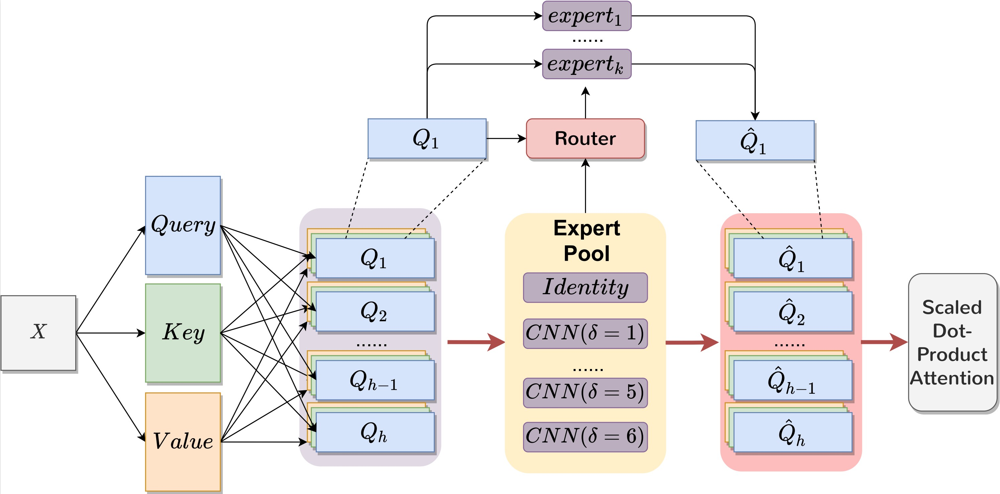

# Ada-MSHA (Adaptive Multi-Scale-Headed Attention), the code for "MoCE: Adaptive Mixture of Contextualization Experts for Byte-based Neural Machine Translation"
> **Authors: [Langlin Huang](https://shrango.github.io/), [Mengyu Bu](https://bingo123122121.github.io/), [Yang Feng*](https://people.ucas.edu.cn/~yangfeng?language=en)**
## Description
We provides a simple but effective multi-scale contextualization module, named **Ada-MSHA** layer. **Ada-MSHA (Adaptive Multi-Scale-Headed Attention)** layer is a variant of Transformer layer, providing local contextualization on each head before *Scaled Dot-Product Attention*, the global contextualization.

It's effective to replace the first Transformer layer with an Ada-MSHA layer for tasks that require local contextualizaion, including `byte-string encoding`, `audio encoding`, etc.

The figure Below shows the structure of an Ada-MSHA layer, specifically the modified attention module.

Making a comparison with traditional Transfromer attention would help better understanding: Transformer attention uses ${Q,K,V}$ as inputs of *Scaled Dot-Product Attention*. Ada-MSHA conducts local contextualization for these heads, yielding ${\hat{Q}, \hat{K},\hat{V}}$ and uses them as inputs of *Scaled Dot-Product Attention*.

The following figure describes how ${Q, K, V}$ become $\hat{Q}, \hat{K}, \hat{V}$. 


We leverage the concept of MoE, and propose **MoCE (Mixture of Contextualization Experts)**. The experts in this structure are heterogeneous, comprising CNNs with different kernel sizes and one Identity function. A `Router` takes in **$x_h^j$** ($x$ represents anyone from [Query, Key, Value], $j$ means the token's position within a sentence, $h$ means the attention head's index), and outputs the proability of choosing these experts. Following typical settings of MoE, we choose the Top-2 experts and calculate their weighted sum as output, **$\hat{x}_h^j$**.

## Install

1. Clone this repository.

```shell
git clone https://github.com/ictnlp/MoCE.git
```

2. Install fairseq.

```
conda create -n moce python=3.8.8
conda activate moce
cd ./fairseq
pip install -e ./
```

Fix possible internal inconsistency between `fairseq` and numpy:
```shell
pip uninstall numpy
pip install numpy==1.23.3
```

## Data preprocess
We provide the preprocess script in [MoCE/scripts/ted59/preprocess.sh](https://github.com/ictnlp/MoCE/blob/main/scripts/ted59/preprocess.sh) and [MoCE/scripts/opus100/preprocess.sh](https://github.com/ictnlp/MoCE/blob/main/scripts/opus100/preprocess.sh)

If you are familiar with fairseq and would like to know the details:

We leverage the preprocess script of [EmbeddinglessNMT](https://github.com/UriSha/EmbeddinglessNMT/blob/master/embeddingless_scripts/byte_preprocess.sh). This is basically the same as standard [fairseq](https://fairseq.readthedocs.io/en/latest/getting_started.html#data-pre-processing), except replacing the [tokenizer.py](https://github.com/facebookresearch/fairseq/blob/main/fairseq/tokenizer.py) file with the [byte-compatible one](https://github.com/ictnlp/MoCE/blob/main/fairseq/fairseq/tokenizer.py).

## Training and Generation
We provide the training and generation scripts in `MoCE/scripts/ted59/` and `MoCE/scripts/opus100/`, including different settings.

By default, we used 4 A100 (40GB) GPUs. In case you need to adjust the batch size to your devices, please make sure the multiplication of `UPDATE_FREQ`, `MAX_TOKENS`, and the number of `CUDA_VISIBLE_DEVICES` unchanged. For ted59, the product is 65536; for opus100, the product is 131072.

## Empirical Results

| Method              | SacreBLEU |    ChrF   |   COMET   |
|---------------------|:---------:|:---------:|:---------:|
| Transformer-subword |   24.79   |   46.70   |   74.46   |
| Transformer-byte    |   25.21   |   47.26   |   74.44   |
| Ada-MSHA(△=5)       |   26.30   |   48.30   |   75.79   |
| +lid                | **26.52** | **48.56** | **76.12** |

(On Ted-59 Dataset)

## Related Repositories
 - [SU4MT](https://github.com/ictnlp/SU4MT): The codebase we built upon. It provides the core idea of Multi-Scale contextualization.
 - [EmbeddinglessNMT](https://github.com/UriSha/EmbeddinglessNMT/tree/master): Provides the implementation of byte-based Transformer baseline system.

## Citation

If you have any questions, please feel free to submit an issue or contact `h.langlin@wustl.edu`.